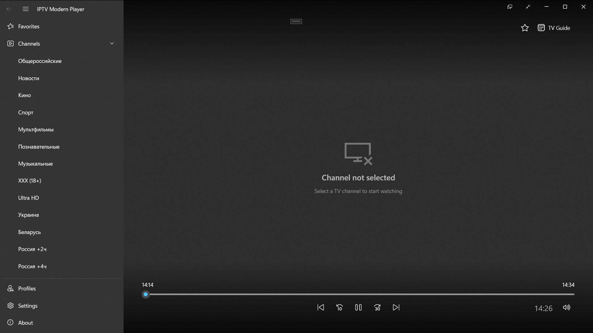
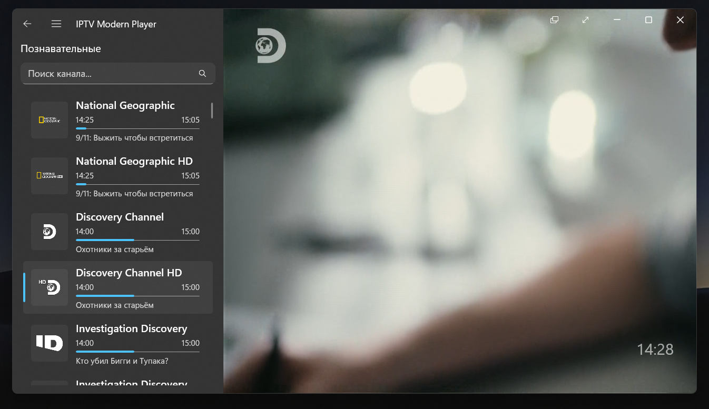
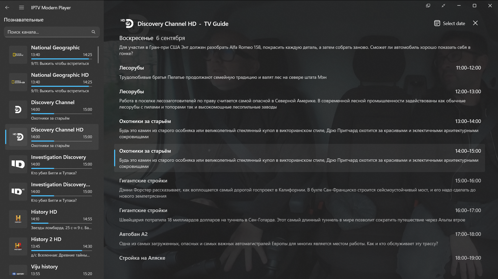
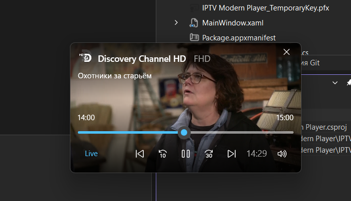
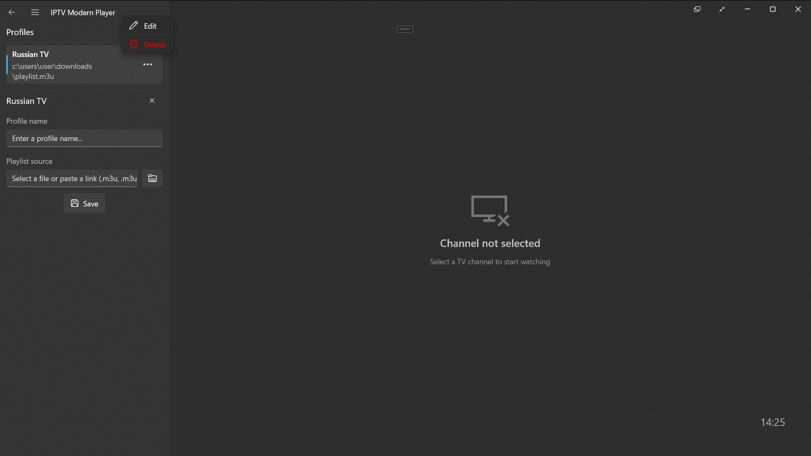
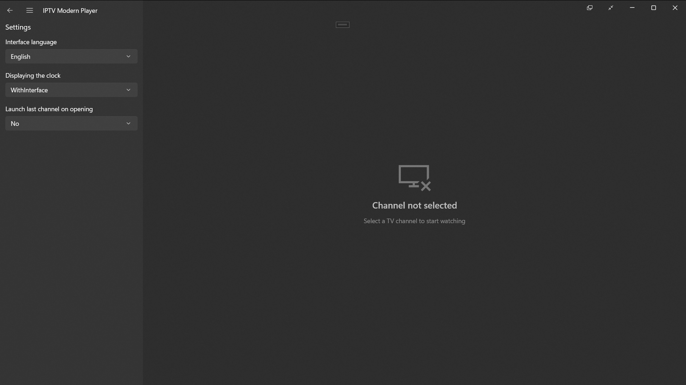
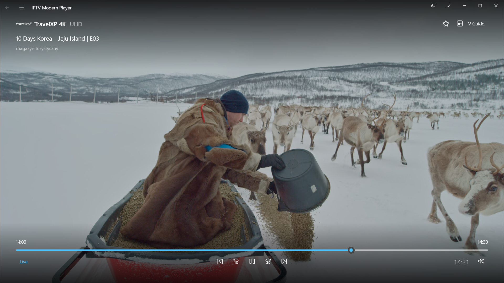
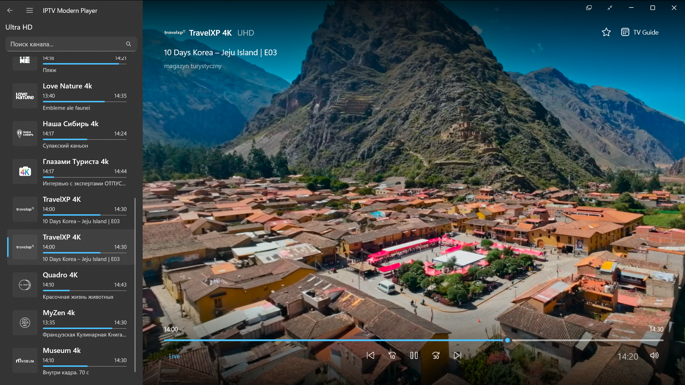

# IPTV Modern Player

A modern IPTV player for Windows with a clean and convenient interface.

IPTV Modern Player allows you to watch IPTV channels from M3U8 playlists and URLs, browse the TV guide, rewind supported content, manage favorite channels, and organize playlists using separate profiles.

## Features

* 📺 **M3U8 Playlists**

  * Open local M3U8 files
  * Open M3U8 playlists and streams from URLs

* 📅 **TV Guide (EPG)**

  * View the program schedule
  * Browse current and upcoming programs

* ⏪ **Catch-up / Rewind**

  * Rewind supported streams
  * Watch previously aired content when catch-up is available

* ⭐ **Favorites**

  * Add channels to your favorites
  * Quickly access your favorite channels

* 👤 **Profiles**

  * Create separate profiles
  * Keep playlists, favorites, and settings separated between profiles

* 🔎 **Channel Search**

  * Quickly find channels within the current group

* 🖥️ **Display Modes**

  * Fullscreen mode
  * Compact mode

* 🌐 **Languages**

  * English
  * Russian

## Screenshots

<table>
<tr>
<td align="center"><strong>Main Menu</strong></td>
<td align="center"><strong>Normal Window</strong></td>
</tr>
<tr>
<td></td>
<td></td>
</tr>

<tr>
<td align="center"><strong>TV Guide</strong></td>
<td align="center"><strong>Compact Overlay</strong></td>
</tr>
<tr>
<td></td>
<td></td>
</tr>

<tr>
<td align="center"><strong>Profiles</strong></td>
<td align="center"><strong>Settings</strong></td>
</tr>
<tr>
<td></td>
<td></td>
</tr>

<tr>
<td align="center"><strong>Default</strong></td>
<td align="center"><strong>Default</strong></td>
</tr>
<tr>
<td></td>
<td></td>
</tr>
</table>

## Download

Download the latest version from the [Releases](../../releases) page.

The application is distributed as an **MSIXBUNDLE** package.

Choose the appropriate package for your system architecture.

## System Requirements

* Windows 10 version 1809 or later
* Windows 11
* x64, x86, or ARM64 processor

## Installation

1. Open the [Releases](../../releases) page.
2. Download the `.msix` package for your system architecture.
3. Open the downloaded package.
4. Follow the Windows installation prompts.
5. Launch **IPTV Modern Player** from the Start menu.

> **Note:** Windows may require you to trust the certificate used to sign the application when installing a package downloaded outside the Microsoft Store.

## IPTV Playlists

IPTV Modern Player does not provide IPTV channels, playlists, subscriptions, or streaming content.

You can use your own M3U8 files and stream URLs or services provided by your IPTV provider.

You are responsible for the content you access through the application and for ensuring that your use of IPTV streams complies with applicable laws and the terms of your IPTV provider.

## Third-Party Software

IPTV Modern Player uses third-party software components, including:

* [LibVLCSharp](https://github.com/videolan/libvlcsharp)
* [VLC / LibVLC](https://www.videolan.org/vlc/)
* [CommunityToolkit.Mvvm](https://github.com/CommunityToolkit/dotnet)
* [Microsoft Windows App SDK](https://github.com/microsoft/WindowsAppSDK)

Each third-party component is distributed under its respective license.

See [THIRD-PARTY-NOTICES.txt](THIRD-PARTY-NOTICES.txt) for additional information and license details.

## License

IPTV Modern Player is proprietary software.

All rights reserved.

The source code is not publicly available and may not be copied, modified, redistributed, or used without permission from the copyright holder.

See [LICENSE](LICENSE) for the full license terms.
